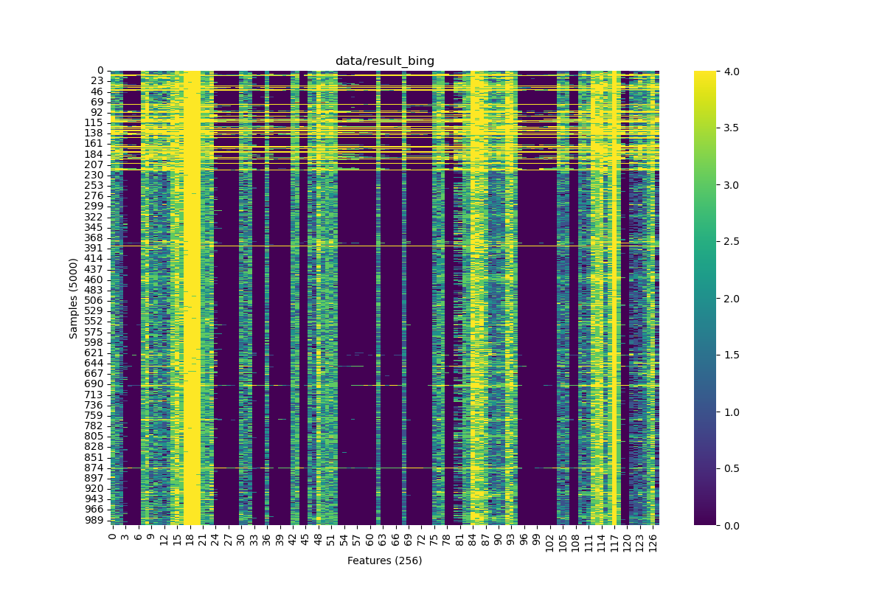

# Timer-Free Cache-based Website Fingerprinting Attack

## Get website fingerprint

Please note that the website fingerprinting is highly dependent on the content of the website; the results may vary as the website content changes (e.g., the website may change its layout, add new features, etc.). We have provided an example data (`Bing`) and one of the trace data (after pre-processing, [`trace.json`](./trace.json), details at below) we used in the paper.

The website fingerprinting collection scripts, `fp_pre_process.py` and the evaluation script, are also provided in this directory.

### Check display variables:

Open a terminal on your display (not from remote ssh), run:

```shell
echo $WAYLAND_DISPLAY
echo $XDG_RUNTIME_DIR
```

Replace the macro definitions `WAYLAND_DISPLAY_NAME` and `XDG_RUNTIME_DIR` in file `smc_fullset_web_fp_fullway.c` with the values you got.

Note: X11 is not yet supported.

### Compile and collect trace

```shell
mkdir -p data
make fullset_web_fp_fullway
```

```shell
# usage: taskset -c 0 ./out/fullset_web_fp_fullway <website> <tag>
# e.g., for Bing:
taskset -c 0 ./out/fullset_web_fp_fullway https://www.bing.com bing
```

The trace file will be saved in `data/result_<tag>.txt` (e.g., `data/result_bing.txt`).

An example data collected from Bing in `Cortex-A76` is provided in [`example_data/result_bing.txt`](./example_data/result_bing.txt).

### Visualize

```shell
# usage: visualize.py [-h] [-f FILE] [-bg BG] [-nc]
# 
# options:
#   -h, --help            show this help message and exit
#   -f FILE, --file FILE  file path
#   -bg BG, --bg BG       background file path
#   -nc, --noise_cancel   whether to cancel noise using the background file
# e.g., for Bing:
python3 fp_visualize.py -f data/result_bing.txt
```

Example output from `example_data/result_bing.txt`:



### Automation Collection from a domain list

Choose a domain list file, e.g., `list_15.txt` (for top 15 websites), `list_100.txt` (for top 100 websites), and copy it to `list.txt`.

After editing the domain list file name, check the repeat count in the file `automation.sh`, then simply run `./automation.sh`. Trace data is saved in `./data/<tag>/<tag>_<count>.txt`; it might take hours to finish.

## Evaluate the fingerprinting attack

```shell
# preprocess the trace data in `data` directory
python3 fp_pre_process.py

# evaluate the fingerprinting attack using `TimeSeriesForestClassifier` from `sktime`
python3 fp_eval.py
```

We have provided a `trace.json` fingerprinting collected and pre-processed the top 15 websites (in `list_15.txt`) from `SiFive P550`. Run `python3 fp_eval.py` to evaluate the accuracy of the attack; it might take a few minutes to finish.

Expected output (`time python3 fp_eval.py`, running on `M4 Pro`, as the evaluation is time-consuming and can be offline executed):

**Stable expected behavior:** the classification accuracy is higher than `95%`.

```shell
Number of traces:  1500
              precision    recall  f1-score   support

      amazon       0.98      0.98      0.98       174
       baidu       1.00      0.98      0.99       188
    bilibili       0.97      1.00      0.98       222
    facebook       1.00      0.99      0.99       220
      google       0.98      0.98      0.98       197
   instagram       0.94      0.94      0.94       199
    linkedin       0.96      0.98      0.97       177
      openai       0.97      0.99      0.98       201
          qq       0.98      1.00      0.99       190
      reddit       0.99      1.00      1.00       223
     twitter       1.00      1.00      1.00       194
    whatsapp       0.96      0.96      0.96       210
   wikipedia       1.00      0.99      0.99       219
     youtube       1.00      0.98      0.99       188
       zhihu       0.99      0.93      0.96       198

    accuracy                           0.98      3000
   macro avg       0.98      0.98      0.98      3000
weighted avg       0.98      0.98      0.98      3000

Confusion Matrix:
[[171   0   0   0   0   1   1   0   0   0   0   0   0   0 1]
 [  0 184   0   0   3   1   0   0   0   0   0   0   0   0 0]
 [  0   0 222   0   0   0   0   0   0   0   0   0   0   0 0]
 [  2   0   0 218   0   0   0   0   0   0   0   0   0   0 0]
 [  0   0   0   1 193   3   0   0   0   0   0   0   0   0 0]
 [  0   0   0   0   0 188   4   0   0   0   0   7   0   0 0]
 [  0   0   0   0   0   1 174   0   0   0   0   1   1   0 0]
 [  0   0   0   0   0   0   0 199   0   2   0   0   0   0 0]
 [  0   0   0   0   0   0   0   0 190   0   0   0   0   0 0]
 [  0   0   0   0   0   0   0   0   0 223   0   0   0   0 0]
 [  0   0   0   0   0   0   0   0   0   0 194   0   0   0 0]
 [  0   0   0   0   0   6   2   0   0   0   0 202   0   0 0]
 [  2   0   0   0   0   0   0   0   0   0   0   0 217   0 0]
 [  0   0   0   0   0   0   0   0   3   0   0   0   0 185 0]
 [  0   0   7   0   0   0   0   6   0   0   0   0   0   0 185]]
python3 fp_eval.py  715.62s user 121.40s system 943% cpu 1:28.75 total
```
